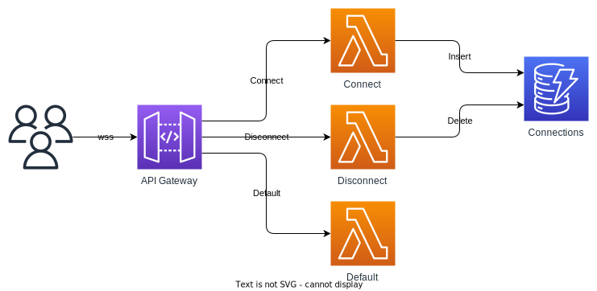
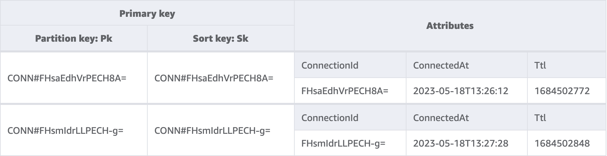

# AwsWebsocketDotnetTemplate
Template for an AWS hosted websocket service using dotnet

## AWS services used
- CloudFormation
- Api Gateway
- Lambda
- DynamoDB

## Requirements
- AWS account 
- AWS CLI ([Installer](https://docs.aws.amazon.com/cli/latest/userguide/getting-started-install.html)) ([Setup](https://docs.aws.amazon.com/cli/latest/userguide/cli-chap-configure.html))
- AWS SAM CLI ([Installer](https://docs.aws.amazon.com/serverless-application-model/latest/developerguide/install-sam-cli.html))
- Dotnet SDK 6+ ([Installer](https://dotnet.microsoft.com/en-us/download))

### Optional additional tools
- Coverlet console ([Install instructions](https://github.com/coverlet-coverage/coverlet#installation-2))
  - Install with `-a arm64` if installing on a machine with an ARM processor (e.g. Macbook with an M1 or M2 processor)
- cfn-lint ([Install instructions](https://github.com/aws-cloudformation/cfn-lint#install))

## Architecture


- User connects to API Gateway via websockets (wss)
- API Gateway invokes Connect Lambda to store the user's unique connection id to DynamoDB
- When the user sends a message through the wss connection, the Default Lambda is invoked to handle the message
    - For now the Default Lambda will parrot the user's message back to the user
- When the user disconnects, the Disconnect Lambda runs to remove the user from DynamoDB
- A time to live (TTL) is configured in DynamoDB to clean up any connections that may have closed without triggering the Disconnect Lambda

### Database


Storing the connection id, the time of connection, and a time to live (ttl) so that any websocket connections that fail to get deleted get cleaned up the next day (or later)

Using a composite key, so that more data can be stored in this table in the future (e.g. channel subscriptions, messages etc.)

## Getting the code
Either clone directly from this repository to try building/deploying, or use this repo as a template for your own websocket project.

### Cloning this repository
In a terminal
```sh
git clone https://github.com/jamsidedown/AwsWebsocketDotnetTemplate.git

# change to src directory
cd src

# restore and build code
dotnet restore
dotnet build
```

### Using this repository as a template
Click the `Use this template` dropdown on the repositories and select `Create a new repository`, alternatively you can navigate straight [here](https://github.com/jamsidedown/AwsWebsocketDotnetTemplate/generate) to create a new repo from this template.

## Running the tests
From the `src` directory, running `dotnet test` will run all unit tests

```sh
$ dotnet test
  Determining projects to restore...
  All projects are up-to-date for restore.
  AwsWebsocketDotnetTemplate -> ./AwsWebsocketDotnetTemplate/bin/Debug/net6.0/AwsWebsocketDotnetTemplate.dll
  AwsWebsocketDotnetTemplate.Tests -> ./AwsWebsocketDotnetTemplate.Tests/bin/Debug/net6.0/AwsWebsocketDotnetTemplate.Tests.dll
Test run for ./AwsWebsocketDotnetTemplate.Tests/bin/Debug/net6.0/AwsWebsocketDotnetTemplate.Tests.dll (.NETCoreApp,Version=v6.0)
Microsoft (R) Test Execution Command Line Tool Version 17.5.0 (arm64)
Copyright (c) Microsoft Corporation.  All rights reserved.

Starting test execution, please wait...
A total of 1 test files matched the specified pattern.

Passed!  - Failed:     0, Passed:    13, Skipped:     0, Total:    13, Duration: 18 ms - AwsWebsocketDotnetTemplate.Tests.dll (net6.0)
```

### Test coverage
Coverage is run with coverlet console, installation instructions are included in the `Optional additional tools` section above.

From the `src` directory, running `./coverage.sh` will run the unit tests and show a coverage report

```sh
$ ./coverage.sh
Test run for ./AwsWebsocketDotnetTemplate.Tests/bin/Debug/net6.0/AwsWebsocketDotnetTemplate.Tests.dll (.NETCoreApp,Version=v6.0)
Microsoft (R) Test Execution Command Line Tool Version 17.5.0 (arm64)
Copyright (c) Microsoft Corporation.  All rights reserved.
Starting test execution, please wait...
A total of 1 test files matched the specified pattern.
Passed!  - Failed:     0, Passed:    13, Skipped:     0, Total:    13, Duration: 17 ms - AwsWebsocketDotnetTemplate.Tests.dll (net6.0)

Calculating coverage result...
  Generating report './coverage.json'
+----------------------------+--------+--------+--------+
| Module                     | Line   | Branch | Method |
+----------------------------+--------+--------+--------+
| AwsWebsocketDotnetTemplate | 86.58% | 100%   | 80.95% |
+----------------------------+--------+--------+--------+

+---------+--------+--------+--------+
|         | Line   | Branch | Method |
+---------+--------+--------+--------+
| Total   | 86.58% | 100%   | 80.95% |
+---------+--------+--------+--------+
| Average | 86.58% | 100%   | 80.95% |
+---------+--------+--------+--------+
```

### Cloudformation template linting
From the root directory, running `cfn-lint template.yaml` will run check the cloudformation template to ensure it can be parsed correctly.

If `cfn-lint` prints any output, then those issues will need to be fixed for the build and deploy to succeed.
No output means the template has correct syntax, but doesn't guarantee the build and deploy will succeed.

## Building and deploying
From the root directory, the SAM CLI can be used to build and deploy to AWS.

The first time a project is deployed it requires some additional parameters for the `sam deploy` command

```sh
# first run a build to compile and package the code
sam build

# then deploy to AWS
# the stack name can be replaced with whatever you choose
sam deploy --stack-name MyWebsocketApi --capabilities CAPABILITY_NAMED_IAM --guided
# leave all guided values as default
```

After the initial deploy, updates to the stack are simpler
```sh
sam build && sam deploy
```
